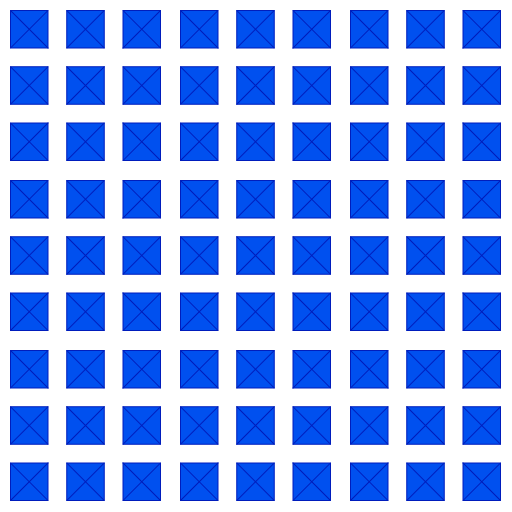

# 9x9-grid_1901020013
## START STATE

### ukuran dari state space untuk semua kotak adalah **81!**

## DIVIDE TO 3X3 Sub-Square

 ### Mengingat tujuannya, kita hanya perlu mempertimbangkan pewarnaan di mana setiap sub-persegi diwarnai secara seragam.  Setelah kita merumuskan kembali bentuk grid 9x9 menjadi 3x3 sub-persegi, masalah dan ukuran ruang keadaan adalah **9!**

### ada dua solusi yang dapat dilakukan untuk mencapai goal state :
## goal state 1

## goal state 2

### Pada goal state 1 kita hanya perlu merubah 36 squares or 4 sub-squares untuk mencapai goal state, tetapi pada goal state 2 maka kita perlu merubah 45 squares or 5 sub-squares untuk mencapai goal state
